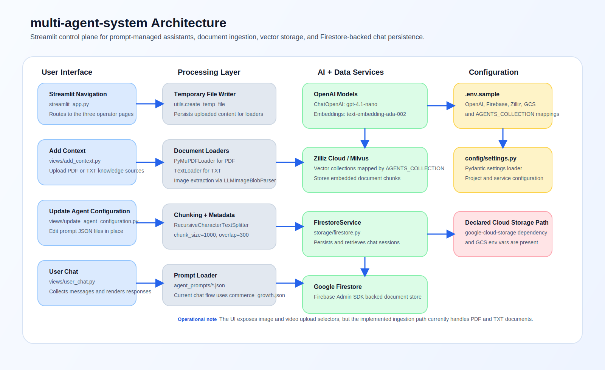
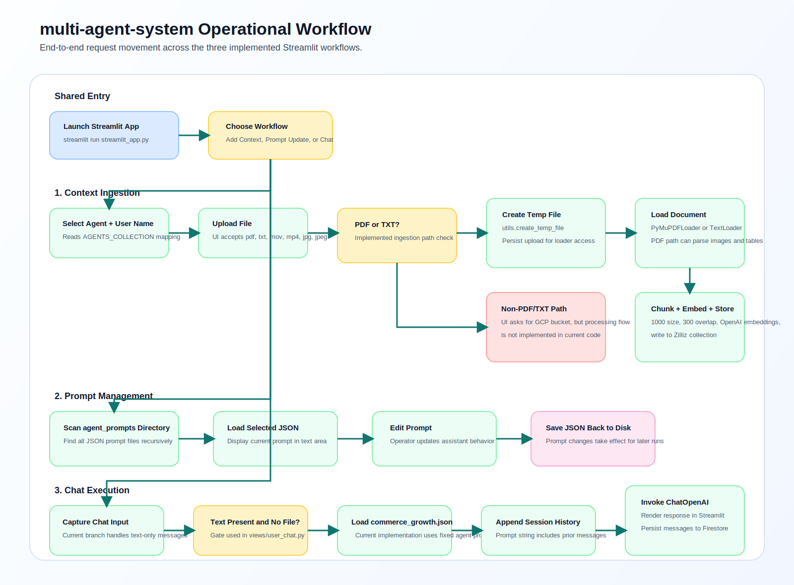

# multi-agent-system
> Multi-agent Streamlit workspace for document-grounded assistance with 1,000-character chunking, 300-character overlap, and persisted chat history in Firestore.

  

## Overview

multi-agent-system is a Python-based Streamlit application for configuring and operating domain-specific AI assistants from a single interface. The app combines three workflows: uploading source documents into a vector database, editing per-agent prompt files, and running chat sessions that persist conversation history to Firestore. It is built for teams that need a simple operational layer around prompt-managed assistants instead of maintaining separate scripts for each workflow. The current implementation uses OpenAI for chat and embeddings, Zilliz Cloud for vector storage, and Firebase/Firestore for chat persistence. Quantified settings present in the codebase include 1,000-character chunks, 300-character overlap during ingestion, and a 50-chat default retrieval limit in Firestore queries.

## Architecture Diagram



## Workflow / Process Flowchart



## Tech Stack

| Category | Technology | Purpose |
|--------|-------|---------|
| Language | Python | Application logic and UI workflows |
| Framework | Streamlit | Multi-page UI for ingestion, prompt editing, and chat |
| ML/AI | LangChain | Document loading, splitting, and vector store integration |
| ML/AI | OpenAI ChatOpenAI (`gpt-4.1-nano`) | Chat response generation and image-aware PDF parsing support |
| ML/AI | OpenAIEmbeddings (`text-embedding-ada-002`) | Embedding generation for vector search ingestion |
| Database/Storage | Zilliz Cloud / Milvus | Vector storage for uploaded document chunks |
| Database/Storage | Google Firestore | Persistent chat history storage |
| Cloud | Firebase Admin SDK | Authenticated access to Firestore project resources |
| Cloud | Google Cloud Storage | Declared dependency and configuration for media storage |
| Testing | pytest, pytest-asyncio, httpx | Commented optional development dependencies listed in `requirements.txt` |

## Key Results & Metrics

| Metric | Value |
|--------|-------|
| Document chunk size | 1000 |
| Document chunk overlap | 300 |
| Firestore chat retrieval limit | 50 |
| API version in sample environment | 1.0.0 |

## Repository Structure

```text
.
|-- agent_prompts/            # JSON prompt definitions for each assistant persona
|   |-- core_assistant.json   # General assistant prompt
|   |-- commerce_growth.json  # Commerce assistant prompt used in chat flow
|   |-- revenue_coach.json    # Sales-focused assistant prompt
|   |-- ...                   # Additional domain-specific prompt files
|-- config/                   # Environment-backed application settings
|   |-- settings.py           # Pydantic settings loader for OpenAI and Firebase config
|-- models/                   # Pydantic schemas for chat data
|   |-- chat.py               # Message, request, response, and history models
|-- storage/                  # Persistence services
|   |-- firestore.py          # Firestore client initialization and chat history operations
|-- views/                    # Streamlit pages exposed in navigation
|   |-- add_context.py        # File upload and vector ingestion workflow
|   |-- update_agent_configuration.py  # Prompt JSON editor
|   |-- user_chat.py          # Chat UI and Firestore-backed session persistence
|-- .streamlit/               # Streamlit runtime configuration
|   |-- config.toml           # Theme and sidebar appearance settings
|-- .env.sample               # Example environment variables required to run the app
|-- requirements.txt          # Python dependencies for UI, LLM, vector DB, and cloud services
|-- streamlit_app.py          # Main Streamlit entry point and page registration
|-- utils.py                  # Temp file handling, document loading, chunking, and vector writes
```

## Getting Started

### 1. Prerequisites

- Python 3.x
- `pip`
- OpenAI API access
- Firebase service account credentials for Firestore
- Zilliz Cloud credentials

Dependency versions are not pinned in `requirements.txt`, so only the model and API version values explicitly present in the repository are listed elsewhere in this README.

### 2. Installation

```bash
python3 -m venv venv
source venv/bin/activate
pip install -r requirements.txt
```

### 3. Configuration

Create a local `.env` file based on `.env.sample` and define these variables:

- `OPENAI_API_KEY`
- `OPENAI_MODEL`
- `FIREBASE_CREDENTIALS_PATH`
- `FIRESTORE_PROJECT_ID`
- `API_TITLE`
- `API_VERSION`
- `API_DESCRIPTION`
- `ALLOWED_ORIGINS`
- `ZILLIZ_CLOUD_URI`
- `ZILLIZ_CLOUD_TOKEN`
- `AGENTS_COLLECTION`
- `GOOGLE_APPLICATION_CREDENTIALS`
- `GCS_BUCKET`

### 4. Running the Project

```bash
streamlit run streamlit_app.py
```

## Author

Manichandra Reddy Bethi  
Machine Learning Engineer | GenAI · RAG · LLM Systems  
Portfolio: https://bethimanichandrareddy.com  
GitHub: https://github.com/Manireddy1508  
LinkedIn: https://linkedin.com/in/bethimanichandrareddy

## License

MIT License
